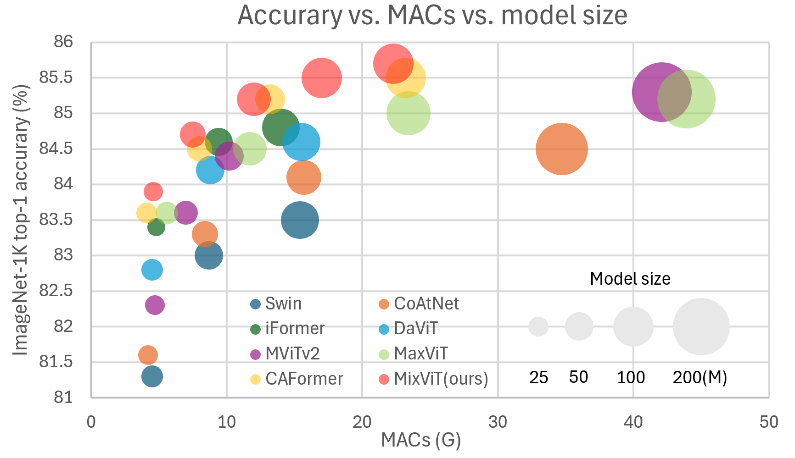
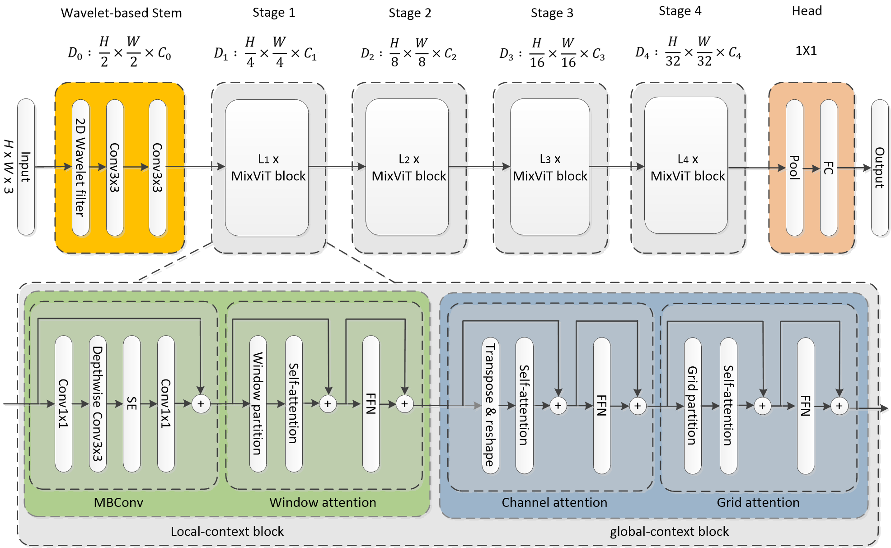
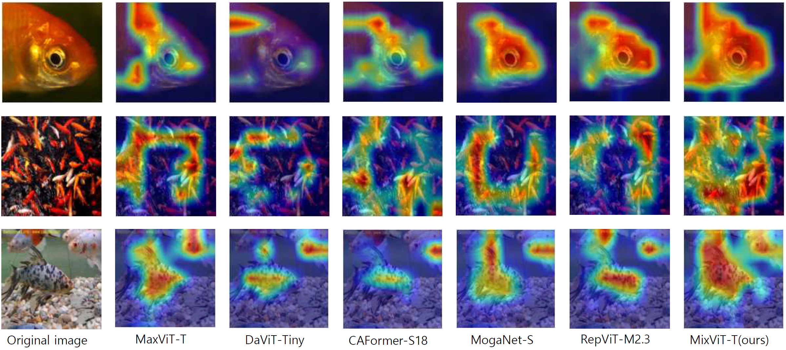

# MixViT: Mixing is all you need for capturing various global contexts in ViT


This paper introduces a novel hybrid vision transformer, called MixViT, which effectively captures both local and global contextual information in images. While window-based vision transformers have demonstrated strong performance in modeling localized patterns, they often struggle to fully capture global dependencies due to their limited receptive fields. To address this limitation, MixViT integrates diverse attention mechanisms—including window-based, grid-based, and channel-based attention—within a unified architecture. Furthermore, MixViT employs a discrete wavelet transform in its embedding stem to decompose input images into multi-frequency components. This enables a richer and more structured representation of visual information from the early stages of the network. Experimental results on various vision tasks show that MixViT achieves higher performance than other ViT models. This performance sets a new state-of-the-art among vision transformers with comparable model complexity. 



## Requirements

```
pip install -r requirements.txt
```

## Results

### ImageNet-1K Trained Models

|   Model   | Resolution | Params (M) | Flops (G) | Top-1 Acc | Download |
| :-------: | :--------: | :--------: | :-------: | :-------: | :------: |
| MixViT-P1 |   224x224  |     5.0    |    1.04   |   79.3%   |          |
| MixViT-P2 |   224x224  |     6.0    |    1.35   |   80.5%   | [here](https://drive.google.com/file/d/1O11PYA3KVq-k9loP1DOGmZH0hta3bRdc/view?usp=sharing)    |
| MixViT-N  |   224x224  |    10.6    |    1.97   |   82.2%   | [here](https://drive.google.com/file/d/12B2cATh5tiPz6Oh1Ww3ozv6Cf3ApDyCo/view?usp=sharing)    |
| MixViT-T  |   224x224  |    23.3    |    4.6    |   84.1%   | [here](https://drive.google.com/file/d/1i5XdYL0hav53-Avq3pzkEyuuL3QwpcLm/view?usp=drive_link) |
| MixViT-T  |   384x384  |    23.3    |   14.1    |   85.3%   | [here](https://drive.google.com/file/d/11_uCAT4oq7d-cg4B-A73UT1MSwypo9k9/view?usp=drive_link) |
| MixViT-S  |   224x224  |    41.7    |    7.5    |   84.7%   | [here](https://drive.google.com/file/d/1H7jGSuBTLOiKPABwzq1VtEq_OPovnhYj/view?usp=drive_link) |
| MixViT-S  |   384x384  |    41.8    |   22.9    |   85.8%   | [here](https://drive.google.com/file/d/1RXZ3_oSDCvaG5KadN5HcDWT65mLU5m4o/view?usp=drive_link) |
| MixViT-M  |   224x224  |    69.7    |   12.4    |   85.3%   | [here](https://drive.google.com/file/d/16nwhpTxG_16SVYHyJNHMO4oeUZ8QDLun/view?usp=drive_link) |
| MixViT-M  |   384x384  |    69.7    |   37.8    |   86.2%   | [here](https://drive.google.com/file/d/19RTQ21KJ316ROlx-txfAqf67lQNdFCjj/view?usp=drive_link) |
| MixViT-B  |   224x224  |   100.0    |   17.0    |   85.5%   | [here](https://drive.google.com/file/d/1N9I-3_Kjbgx3Az5bIgwdDnjK0FIISh1S/view?usp=sharing)    |
| MixViT-B  |   256x256  |   100.0    |   22.2    |   85.7%   | [here](https://drive.google.com/file/d/1AP_svEW7DSVxkHickuBvScIFYOFrSAwy/view?usp=sharing)    |
| MixViT-B  |   384x384  |   100.0    |   51.7    |   86.3%   | |

### Anaylysis 
The code to validate accuracy of MixViT.
```shell
python validate.py /path/to/imagenet-1k --model mixvit_t_224 --checkpoint /path/to/checkpoint --img-size 224
```

The code to count params and flops of MixViT variants
```shell
python get_flops.py --model mixvit_t_224  --img-size 224
```

The code to visuallize Grad-CAM activation maps
```shell
python cam_image.py --data-dir ./images --checkpoint /path/to/checkpoint
```


### Object Detection
|   Method   | Backbone |   Pretrain  | Resolution | Params | FLOPS  | Lr schd | box mAP | AP50 | AP75 | mask mAP | AP50 | AP75 | Download |
| :--------: | :------: | :---------: | :--------: | :----: | :----: | :-----: | :-----: | :--: | :--: | :------: | :--: | :--: | :------: |
| Mask R-CNN | MixViT-T | ImageNet-1K | 1120 x 896 |  42.7M | 254.6G |  MS 3x  |   48.6  | 70.6 | 53.6 |   43.7   | 67.6 | 47.2 | [here](https://drive.google.com/file/d/1h0E4pVdz3QOiT_5eg46FPd5kc7Yr3NBt/view?usp=drive_link) |

|       Method       | Backbone |   Pretrain  | Resolution | Params | FLOPS |  Lr schd   | box mAP | AP50 | AP75 | mask mAP | AP50 | AP75 | Download |
| :----------------: | :------: | :---------: | :--------: | :----: | :---: | :--------: | :-----: | :--: | :--: | :------: | :--: | :--: | :------: |
| Cascade Mask R-CNN | MixViT-T | ImageNet-1K | 1120 x 896 |  80.5M |  733G | GIOU+MS 3x |  52.3   | 71.1 | 56.6 |  45.2    | 68.4 | 49.0 | [here](https://drive.google.com/file/d/1XS2FZre0QcdbC4teWoDZBt9IDOvBjJfu/view?usp=drive_link) |
| Cascade Mask R-CNN | MixViT-S | ImageNet-1K | 1120 x 896 |  98.9M |  788G | GIOU+MS 3x |  53.2   | 72.2 | 57.9 |  46.0    | 69.6 | 49.9 | [here](https://drive.google.com/file/d/1QvN5exdoPUH-aseNuf2oBudX5RbbKWrs/view?usp=drive_link) |
| Cascade Mask R-CNN | MixViT-M | ImageNet-1K | 1120 x 896 | 126.7M |  885G | GIOU+MS 3x |  53.6   | 72.4 | 58.2 |  46.4    | 69.8 | 50.5 | [here](https://drive.google.com/file/d/1521Uu4TtgDfMaVdH2cIEtya_8L0Xu0YS/view?usp=drive_link) |


### Video Prediction on Moving MNIST
| Architecture |   Setting  | Params | FLOPs |  MSE  |  MAE  |  SSIM  |  PSNR | Download |
| :----------: | :--------: | :----: | :---: | :---: | :---: | :----: | :---: | :------: |
|   MixViT     |  200 epoch |  37.6M | 14.0G | 25.68 | 75.59 | 0.9317 | 38.38 | [here](https://drive.google.com/file/d/1yAO4uUK1H9ir9BuR3GYb3roiuz2RZr54/view?usp=drive_link) |
|   MixViT     | 2000 epoch |  37.6M | 14.0G | 16.37 | 53.57 | 0.9579 | 39.26 | [here](https://drive.google.com/file/d/1TZyKG5IfOzNArwJy6GJwdILiHZxSY0fW/view?usp=drive_link) |


## Contributing
- [pytorch-image-modes (timm)](https://github.com/huggingface/pytorch-image-models)
- [MaxViT](https://github.com/google-research/maxvit)
- [MogaNet](https://github.com/Westlake-AI/MogaNet) 
- [MMDetection](https://github.com/open-mmlab/mmdetection)
- [OpenSTL](https://github.com/chengtan9907/OpenSTL)
